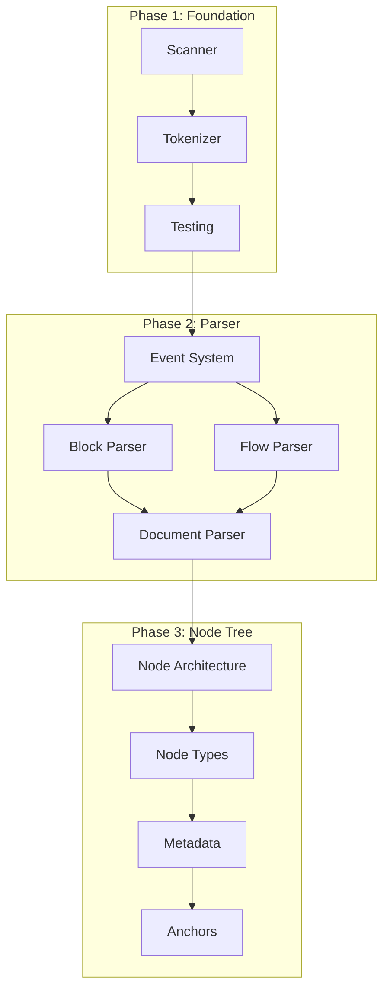

# GitHub Project Board Structure

## Project: YAML Library Independence v2.0

### Board Views

#### 1. Kanban Board (Default View)
**Columns:**
- 🆕 **Backlog**: All unstarted issues
- 📋 **Ready**: Issues ready to be worked on (dependencies met)
- 🚀 **In Progress**: Active development
- 👀 **In Review**: PRs open, code review in progress
- ✅ **Done**: Completed and merged
- ⚠️ **Blocked**: Issues with blockers

#### 2. Roadmap View (Timeline)
**Milestones by Phase:**
- **Phase 1: Foundation** (Weeks 1-4)
  - Milestone 1.1: Lexical Scanner
  - Milestone 1.2: Tokenizer
  - Milestone 1.3: Testing Infrastructure
- **Phase 2: Parser** (Weeks 5-8)
  - Milestone 2.1: Event System
  - Milestone 2.2: Block Style Parser
  - Milestone 2.3: Flow Style Parser
  - Milestone 2.4: Document Parser
- **Phase 3: Node Tree Builder** (Weeks 9-12)
  - Milestone 3.1: Node Architecture
  - Milestone 3.2: Node Types
  - Milestone 3.3: Metadata Preservation
  - Milestone 3.4: Anchor Resolution
- **Phase 4: Serialization** (Weeks 13-16)
  - Milestone 4.1: Emitter Architecture
  - Milestone 4.2: Scalar Emitter
  - Milestone 4.3: Collection Emitter
  - Milestone 4.4: Formatting
- **Phase 5: Type System** (Weeks 17-20)
  - Milestone 5.1: Schema Architecture
  - Milestone 5.2: Core Schemas
  - Milestone 5.3: Type Resolution
- **Phase 6: Advanced Features** (Weeks 21-24)
  - Milestone 6.1: Streaming Parser
  - Milestone 6.2: Validation Framework
  - Milestone 6.3: Transformation DSL
  - Milestone 6.4: Performance
- **Phase 7: Migration & Compatibility** (Weeks 25-28)
  - Milestone 7.1: Compatibility Layer
  - Milestone 7.2: Testing
  - Milestone 7.3: Documentation

#### 3. Sprint Board
**2-Week Sprint Cycles:**
- Sprint Planning
- Sprint Active
- Sprint Review
- Sprint Retrospective

### Custom Fields

#### Priority
- 🔴 **P0**: Critical blocker
- 🟠 **P1**: High priority
- 🟡 **P2**: Medium priority
- 🟢 **P3**: Low priority

#### Complexity (Story Points)
- **XS**: 1 point (< 2 hours)
- **S**: 2 points (2-4 hours)
- **M**: 3 points (4-8 hours)
- **L**: 5 points (1-2 days)
- **XL**: 8 points (2-4 days)
- **XXL**: 13 points (1 week)

#### Component
- 📖 Scanner
- 🔤 Tokenizer
- 🎯 Parser
- 🌳 Node Tree
- 📝 Emitter
- 🔍 Schema
- 🔄 Transform
- 🔎 Query
- ✔️ Validation
- 🧪 Testing
- 📚 Documentation

#### Status Indicators
- ✅ Ready (all dependencies met)
- 🔄 In Progress
- ⏸️ On Hold
- ❌ Blocked
- 🚢 Shipped

### Labels

#### Type Labels
- `type: feature` - New functionality
- `type: bug` - Bug fix
- `type: refactor` - Code refactoring
- `type: test` - Test addition or modification
- `type: docs` - Documentation
- `type: performance` - Performance improvement
- `type: security` - Security enhancement

#### Phase Labels
- `phase-1: foundation`
- `phase-2: parser`
- `phase-3: node-tree`
- `phase-4: serialization`
- `phase-5: type-system`
- `phase-6: advanced`
- `phase-7: migration`

#### Status Labels
- `status: ready` - Ready to work on
- `status: in-progress` - Being worked on
- `status: blocked` - Blocked by dependency
- `status: needs-review` - Needs code review
- `status: needs-testing` - Needs testing

#### Priority Labels
- `priority: critical` - P0
- `priority: high` - P1
- `priority: medium` - P2
- `priority: low` - P3

#### Component Labels
- `component: scanner`
- `component: parser`
- `component: emitter`
- `component: schema`
- `component: testing`

### Automation Rules

#### Auto-move Issues
1. When PR is opened → Move to "In Review"
2. When PR is merged → Move to "Done"
3. When issue is assigned → Move to "In Progress"
4. When "blocked" label added → Move to "Blocked"
5. When "ready" label added → Move to "Ready"

#### Auto-labeling
1. Issues with "YAML-001" to "YAML-014" → Add `phase-1: foundation`
2. Issues with "YAML-015" to "YAML-032" → Add `phase-2: parser`
3. Issues with "YAML-033" to "YAML-050" → Add `phase-3: node-tree`
4. Issues with "YAML-051" to "YAML-066" → Add `phase-4: serialization`
5. Issues with "YAML-067" to "YAML-078" → Add `phase-5: type-system`
6. Issues with "YAML-079" to "YAML-094" → Add `phase-6: advanced`
7. Issues with "YAML-095" to "YAML-106" → Add `phase-7: migration`

### Metrics & Tracking

#### Velocity Chart
- Track story points completed per sprint
- Average velocity calculation
- Sprint burndown charts

#### Cumulative Flow Diagram
- Visualize work in progress
- Identify bottlenecks
- Track cycle time

#### Progress Indicators
- Overall completion percentage
- Phase completion status
- Milestone progress bars
- Dependency tracking graph

### Issue Templates for ROADMAP

```yaml
name: YAML Roadmap Task
description: Task from the YAML Independence Roadmap
title: "[YAML-XXX] Task Title"
labels: ["roadmap", "yaml-v2"]
assignees: []
body:
  - type: markdown
    attributes:
      value: |
        ## Task from YAML Independence Roadmap
  
  - type: input
    id: task-id
    attributes:
      label: Task ID
      description: YAML-XXX identifier from roadmap
      placeholder: "YAML-001"
    validations:
      required: true
  
  - type: dropdown
    id: phase
    attributes:
      label: Phase
      options:
        - Phase 1: Foundation
        - Phase 2: Parser
        - Phase 3: Node Tree Builder
        - Phase 4: Serialization
        - Phase 5: Type System
        - Phase 6: Advanced Features
        - Phase 7: Migration & Compatibility
    validations:
      required: true
  
  - type: textarea
    id: description
    attributes:
      label: Task Description
      description: Detailed description from the roadmap
    validations:
      required: true
  
  - type: textarea
    id: acceptance-criteria
    attributes:
      label: Acceptance Criteria
      description: What defines this task as complete?
      value: |
        - [ ] Implementation complete
        - [ ] Unit tests passing
        - [ ] Documentation updated
        - [ ] Code review approved
    validations:
      required: true
  
  - type: textarea
    id: dependencies
    attributes:
      label: Dependencies
      description: List any tasks that must be completed first
      placeholder: "Depends on: YAML-001, YAML-002"
  
  - type: dropdown
    id: complexity
    attributes:
      label: Estimated Complexity
      options:
        - XS (1 point)
        - S (2 points)
        - M (3 points)
        - L (5 points)
        - XL (8 points)
        - XXL (13 points)
    validations:
      required: true
```

### Weekly Status Report Template

```markdown
## Week X Status Report

### Completed This Week
- YAML-XXX: Description
- YAML-XXX: Description

### In Progress
- YAML-XXX: Description (X% complete)
- YAML-XXX: Description (X% complete)

### Blocked
- YAML-XXX: Description (Blocker: reason)

### Next Week Plan
- YAML-XXX: Description
- YAML-XXX: Description

### Metrics
- Story Points Completed: X
- Velocity: X points/week
- Phase Progress: Phase X (X% complete)
- Overall Progress: X% (XX/106 tasks)

### Risks & Issues
- Risk/Issue description and mitigation plan
```

### Dashboard Queries

#### Critical Path Items
```graphql
is:issue is:open label:"priority: critical" label:roadmap
```

#### Current Sprint
```graphql
is:issue is:open milestone:"Sprint-Current" assignee:@me
```

#### Blocked Items
```graphql
is:issue is:open label:"status: blocked" label:roadmap
```

#### Ready for Review
```graphql
is:pr is:open label:"status: needs-review" label:roadmap
```

#### Phase Progress
```graphql
# Phase 1
is:issue label:"phase-1: foundation"

# Phase 2
is:issue label:"phase-2: parser"

# Add similar queries for all phases
```

### Dependency Graph



### Integration with CI/CD

#### Auto-close on Merge
```yaml
# In PR description
Closes #YAML-001
Closes #YAML-002
```

#### Status Checks
- All tests passing
- Code coverage maintained
- No security vulnerabilities
- Documentation updated
- Benchmarks show no regression

### Review Checklist

- [ ] Code follows SOLID principles
- [ ] No external dependencies added
- [ ] YAML 1.2.2 compliance maintained
- [ ] Tests added/updated
- [ ] Documentation updated
- [ ] Benchmarks run
- [ ] Breaking changes documented
- [ ] Migration guide updated (if needed)

---

## Setup Instructions

1. **Create GitHub Project**
   ```bash
   gh project create --title "YAML Library Independence v2.0" \
     --body "Tracking progress for removing yaml.v3 dependency"
   ```

2. **Configure Columns**
   ```bash
   gh project field-create <project-id> --name "Priority" \
     --data-type "SINGLE_SELECT" \
     --single-select-options "P0,P1,P2,P3"
   
   gh project field-create <project-id> --name "Complexity" \
     --data-type "SINGLE_SELECT" \
     --single-select-options "XS,S,M,L,XL,XXL"
   
   gh project field-create <project-id> --name "Component" \
     --data-type "SINGLE_SELECT" \
     --single-select-options "Scanner,Parser,Emitter,Schema,Testing"
   ```

3. **Import Issues**
   ```bash
   # Script to create all 106 issues
   for i in {1..106}; do
     issue_num=$(printf "%03d" $i)
     gh issue create --title "[YAML-${issue_num}] Task from Roadmap" \
       --body "See ROADMAP.md for details" \
       --label "roadmap,yaml-v2"
   done
   ```

4. **Link to Project**
   ```bash
   gh issue list --label "roadmap" --limit 106 --json number \
     --jq '.[] | .number' | \
     xargs -I {} gh project item-add <project-id> --issue {}
   ```

---

*This project board structure ensures systematic tracking of the YAML library independence effort with clear visibility into progress, dependencies, and blockers.*
