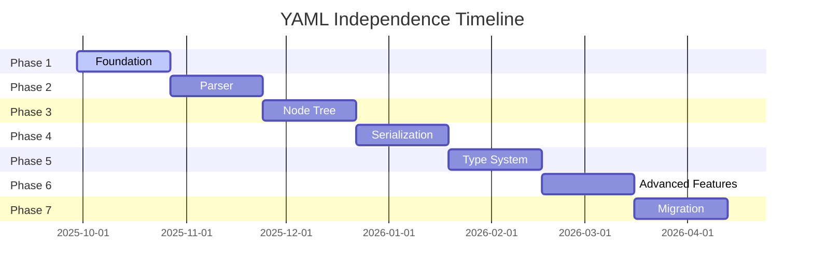

# YAML Independence Project Dashboard

## Quick Links
- [Project Board](https://github.com/elioetibr/golang-yaml-advanced/projects/1)
- [Roadmap](../ROADMAP.md)
- [Architecture](../docs/ARCHITECTURE_V2.md)
- [Progress Report](.github/PROGRESS.md)

## Current Sprint
<!-- Auto-generated sprint information -->

### Sprint 1 (Weeks 1-2)
**Focus**: Foundation - Scanner Implementation

#### Goals
- [ ] YAML-001: Byte stream reader
- [ ] YAML-002: Rune scanner
- [ ] YAML-003: Lookahead mechanism
- [ ] YAML-004: Position tracking
- [ ] YAML-005: Scanner configuration

#### Metrics
- **Velocity Target**: 15 story points
- **Actual**: TBD
- **Blockers**: None

## Phase Status



## Key Metrics

### Velocity Chart
```
 Sprint 1: [==========] 0/15 points
 Sprint 2: [          ] 0/15 points
 Sprint 3: [          ] 0/18 points
 Sprint 4: [          ] 0/18 points
```

### Code Quality
- **Coverage**: 
- **Tests**: 
- **Benchmarks**: 
- **Security**: 

### Dependency Status
- **Current**: `gopkg.in/yaml.v3` (to be removed)
- **Target**: Zero external dependencies
- **Progress**: 0% migrated

## Risk Register

| Risk | Impact | Likelihood | Mitigation | Status |
|------|--------|------------|------------|--------|
| Complex YAML edge cases | High | Medium | Extensive test suite | 🟢 Monitoring |
| Performance regression | Medium | Low | Continuous benchmarking | 🟢 Monitoring |
| Breaking changes | High | Low | Compatibility layer | 🟡 Planning |
| Resource availability | Medium | Medium | Flexible timeline | 🟢 Monitoring |

## Recent Activity
<!-- This section would be auto-populated by GitHub Actions -->

### Last Week
- 🚀 Started Phase 1: Foundation
- 📝 Created comprehensive roadmap
- 🎯 Set up project board structure
- 🤖 Configured automation workflows

### This Week
- [ ] Begin scanner implementation
- [ ] Set up testing infrastructure
- [ ] Create initial benchmarks
- [ ] Document API design

## Team Resources

### Documentation
- [Contributing Guide](../CONTRIBUTING.md)
- [Code of Conduct](../CODE_OF_CONDUCT.md)
- [Security Policy](../SECURITY.md)
- [Deprecation Policy](../DEPRECATIONS.md)

### Development
- [Docker Testing](../docker-compose.test.yml)
- [Makefile Targets](../Makefile)
- [CI/CD Workflows](.github/workflows/)

## Useful Queries

### GitHub CLI
```bash
# View all roadmap issues
gh issue list --label roadmap

# View current sprint
gh issue list --label "sprint-current"

# View blocked items
gh issue list --label "status: blocked"

# View items ready for review
gh pr list --label "status: needs-review"
```

### Project Filters
```
# Critical path items
is:issue is:open label:"priority: critical" label:roadmap

# My assigned items
is:issue is:open assignee:@me label:roadmap

# Phase 1 progress
is:issue label:"phase-1: foundation"
```

## Success Criteria Tracking

### Performance Targets
- [ ] Parser: >100MB/s for typical YAML
- [ ] Memory: <2x input size for tree building  
- [ ] Streaming: Constant memory for large files

### Quality Targets
- [ ] Test Coverage: >95%
- [ ] YAML Test Suite: 100% pass rate
- [ ] Zero dependencies (stdlib only)
- [ ] Full YAML 1.2.2 compliance

### API Design Goals
- [ ] Idiomatic Go interfaces
- [ ] Comprehensive error handling
- [ ] Plugin architecture
- [ ] Backward compatibility option

## Release Milestones

### v2.0.0-alpha (Week 12)
- Core parser complete
- Basic serialization
- Limited yaml.v3 compatibility

### v2.0.0-beta (Week 20)
- Full YAML 1.2.2 support
- Performance optimized
- Migration tools ready

### v2.0.0 (Week 28)
- Production ready
- Full documentation
- 100% test coverage
- Performance targets met

---

## Quick Actions

### Create New Issue
```bash
gh issue create \
  --title "[YAML-XXX] Title" \
  --label "roadmap,phase-X" \
  --body "Task description"
```

### Update Progress
```bash
make project-update
```

### Run Tests
```bash
make compose-test
```

### Generate Report
```bash
make project-report
```

---

*Dashboard updated: September 28, 2025*
*Next review: October 5, 2025*
