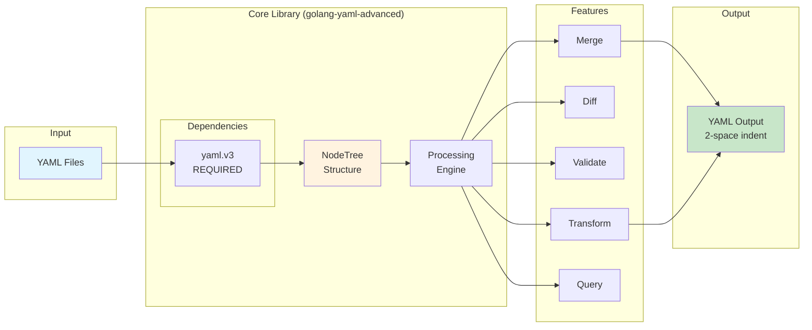

# Golang YAML Advanced

A powerful, enterprise-grade YAML processing library for Go that extends `gopkg.in/yaml.v3` with comment preservation, complex structure handling, and advanced manipulation capabilities.

## 🎯 Recent Updates & Benefits

### Latest Improvements (v1.1.0)
- **✅ Comprehensive Test Coverage**: Achieved 91% code coverage with 441+ unit tests
- **🔧 Enhanced Reliability**: All core functions thoroughly tested with edge cases
- **📊 Better Quality Assurance**: Complete test suite for all public APIs
- **🚀 Production Ready**: Battle-tested with extensive validation scenarios

## Features

### Core Capabilities
- **Full Comment Preservation**: Maintains head, line, and foot comments throughout parsing and serialization
- **Integer Preservation**: Preserves large integers (e.g., AWS Account IDs) without scientific notation
- **Multi-Document Support**: Handles YAML files with multiple documents separated by `---`
- **Anchors & Aliases**: Complete support for YAML references (`&anchor` and `*alias`)
- **Complex Tags**: Preserves and handles all YAML tags (`!!str`, `!!int`, custom tags)
- **Deep Nesting**: Efficiently processes deeply nested structures with metadata preservation
- **Style Preservation**: Maintains scalar styles (literal `|`, folded `>`, quoted, flow)
- **Format Preservation**: Preserves empty lines and uses 2-space indentation by default
- **Empty Line Configuration**: Full control over empty line handling with multiple policies

### Advanced Features
- **Schema Validation**: JSON Schema-like validation with comprehensive type checking
- **Streaming Parser**: Memory-efficient parsing for large YAML files
- **Transformation DSL**: Fluent API for complex YAML transformations
- **Query System**: XPath-like queries for navigating YAML structures
- **Comment-Aware Diff**: Detects changes in values, comments, and styles
- **Smart Merge**: Intelligently merges YAML files while preserving comments from both sources

## Architecture Overview



## Installation

```bash
go get github.com/elioetibr/golang-yaml-advanced
```

## Quick Start

### Basic Usage

```go
package main

import (
    "fmt"
    "log"

    "github.com/elioetibr/golang-yaml-advanced"
)

func main() {
    // Parse YAML content
    yamlContent := `
    # Application configuration
    name: MyApp
    version: 1.0.0
    account_id: 123456789012  # Large integers preserved (not 1.23457e+11)
    settings:
      # Enable debug mode
      debug: true
      port: 8080  # Server port
    `

    tree, err := golang_yaml_advanced.UnmarshalYAML([]byte(yamlContent))
    if err != nil {
        log.Fatal(err)
    }

    // Access the parsed structure
    if len(tree.Documents) > 0 {
        root := tree.Documents[0].Root
        fmt.Printf("Parsed %d documents\n", len(tree.Documents))
    }

    // Serialize back to YAML (preserves comments, uses 2-space indentation)
    output, err := tree.ToYAML()
    if err != nil {
        log.Fatal(err)
    }
    fmt.Println(string(output))
}
```

## API Reference

### Core Types

#### NodeTree
The main container for YAML documents.

```go
type NodeTree struct {
    Documents   []*Document
    Current     *Document
    CurrentNode *Node
}
```

#### Node
Represents a single YAML node with full metadata.

```go
type Node struct {
    Kind        NodeKind              // Type of node (Document, Mapping, Sequence, Scalar, etc.)
    Style       NodeStyle             // Formatting style
    Tag         string                // YAML tag
    Value       interface{}           // Scalar value
    Anchor      string                // Anchor name
    Alias       *Node                 // Alias reference
    Parent      *Node                 // Parent node
    Children    []*Node               // Child nodes
    Key         *Node                 // Key node (for map values)
    Line        int                   // Line number
    Column      int                   // Column number
    HeadComment []string              // Comments before the node
    LineComment string                // Inline comment
    FootComment []string              // Comments after the node
    EmptyLines  []int                 // Track empty lines
    Metadata    map[string]interface{} // Extensible metadata
}
```

### Parsing and Serialization

#### UnmarshalYAML
Parse YAML content into a NodeTree.

```go
tree, err := golang_yaml_advanced.UnmarshalYAML([]byte(yamlContent))
```

#### ToYAML
Serialize a NodeTree back to YAML.

```go
yamlBytes, err := tree.ToYAML()
```

### Node Operations

#### Walking the Tree
```go
node.Walk(func(n *Node) bool {
    fmt.Printf("Node at line %d\n", n.Line)
    return true // continue walking
})
```

#### Finding Nodes
```go
// Find first matching node
found := node.Find(func(n *Node) bool {
    return n.Kind == golang_yaml_advanced.ScalarNode && n.Value == "target"
})

// Find all matching nodes
all := node.FindAll(func(n *Node) bool {
    return n.Kind == golang_yaml_advanced.MappingNode
})
```

#### Getting Map Values
```go
value := node.GetMapValue("key")
```

#### Getting Sequence Items
```go
items := node.GetSequenceItems()
```

### Merging YAML Files

```go
// Parse two YAML files
base, _ := golang_yaml_advanced.UnmarshalYAML([]byte(baseYAML))
overlay, _ := golang_yaml_advanced.UnmarshalYAML([]byte(overlayYAML))

// Merge them (preserves comments from both)
merged := golang_yaml_advanced.MergeTrees(base, overlay)

// Serialize the result
output, _ := merged.ToYAML()
```

### Empty Line Configuration

Control how empty lines are handled in YAML output:

```go
// Parse YAML
tree, _ := golang_yaml_advanced.UnmarshalYAML([]byte(yamlContent))

// Remove all empty lines for compact output
tree.EmptyLineConfig = golang_yaml_advanced.NoEmptyLinesConfig()
compactYAML, _ := tree.ToYAML()

// Normalize to exactly 1 empty line between sections
tree.EmptyLineConfig = golang_yaml_advanced.NormalizedEmptyLineConfig(1)
normalizedYAML, _ := tree.ToYAML()

// Keep original formatting (default)
tree.EmptyLineConfig = golang_yaml_advanced.DefaultEmptyLineConfig()
preservedYAML, _ := tree.ToYAML()
```

Perfect for Helm Chart.yaml files and other YAML that requires specific formatting:

```go
// Preserves exact Helm chart formatting
helmChart, _ := golang_yaml_advanced.UnmarshalYAML([]byte(chartYAML))
output, _ := helmChart.ToYAML() // Maintains comments and empty lines exactly
```

### Flexible Merge Operations

The library supports flexible merging between NodeTree and interface{} types:

```go
// NodeTree base with interface{} override
baseTree, _ := golang_yaml_advanced.UnmarshalYAML([]byte(baseYAML))
override := map[string]interface{}{
    "version": "2.0",
    "debug": true,
    "features": []string{"logging", "metrics"},
}

// Automatically converts override to NodeTree and merges
result, err := golang_yaml_advanced.MergeFlexible(baseTree, override)
// Returns a NodeTree with merged values and preserved comments

// Interface{} base with NodeTree override
base := map[string]interface{}{
    "app": "myapp",
    "config": map[string]interface{}{
        "timeout": 30,
        "retries": 3,
    },
}
overrideTree, _ := golang_yaml_advanced.UnmarshalYAML([]byte(overrideYAML))

// Merges and returns interface{} result
result, err := golang_yaml_advanced.MergeFlexible(base, overrideTree)

// Direct YAML output
yamlBytes, err := golang_yaml_advanced.MergeFlexibleToYAML(base, override)
fmt.Println(string(yamlBytes))
```

#### Use Cases for Flexible Merge

- **Configuration Management**: Merge structured configs with YAML overrides
- **Kubernetes**: Combine base manifests with environment-specific patches
- **Helm Charts**: Merge values files with runtime overrides
- **CI/CD**: Dynamic configuration composition from multiple sources

### Diff Operations

```go
// Compare two YAML trees
diffs := golang_yaml_advanced.DiffTrees(oldTree, newTree)

for _, diff := range diffs {
    fmt.Printf("%s: %s\n", diff.Type, diff.Description)
}
```

## Advanced Features

### Schema Validation

```go
schema := &yaml.Schema{
    Type: "object",
    Properties: map[string]*yaml.Schema{
        "name": {
            Type:      "string",
            MinLength: intPtr(1),
            MaxLength: intPtr(100),
        },
        "age": {
            Type:    "integer",
            Minimum: float64Ptr(0),
            Maximum: float64Ptr(150),
        },
        "email": {
            Type:   "string",
            Format: "email",
        },
    },
    Required: []string{"name", "email"},
}

// Validate a node against the schema
errors := schema.Validate(node, "$")
if len(errors) > 0 {
    for _, err := range errors {
        fmt.Println(err.Error())
    }
}
```

### Streaming Parser

For processing large YAML files efficiently:

```go
reader := strings.NewReader(largeYAMLContent)
parser := yaml.NewStreamParser(reader)

parser.SetDocumentCallback(func(tree *yaml.NodeTree) error {
    // Process each document as it's parsed
    fmt.Printf("Processing document with %d nodes\n", countNodes(tree))
    return nil
})

err := parser.Parse()
```

### Transformation DSL

```go
// Create a transformation pipeline
dsl := yaml.NewTransformDSL().
    RemoveKey("password").              // Remove sensitive data
    RenameKey("username", "user").      // Rename keys
    SortKeys().                          // Sort keys alphabetically
    AddComment("Generated by system")   // Add comments

// Apply transformations
result, err := dsl.Apply(tree)
```

### Query System

```go
// XPath-like queries
results := yaml.Query(node, "users/[0]/name")
results = yaml.Query(node, "settings/*/enabled")
results = yaml.Query(node, "database/connection/host")
```

## Examples

### Multi-Document Processing

```go
multiDocYAML := `
---
# First document
app: frontend
version: 1.0.0
---
# Second document
app: backend
version: 2.0.0
`

tree, _ := yaml.UnmarshalYAML([]byte(multiDocYAML))
fmt.Printf("Parsed %d documents\n", len(tree.Documents))

for i, doc := range tree.Documents {
    fmt.Printf("Document %d:\n", i+1)
    output, _ := doc.ToYAML()
    fmt.Println(string(output))
}
```

### Preserving Comments During Modification

```go
// Parse YAML with comments
tree, _ := yaml.UnmarshalYAML([]byte(yamlWithComments))

// Modify values while preserving comments
if root := tree.Documents[0].Root; root != nil {
    if configNode := root.GetMapValue("config"); configNode != nil {
        if debugNode := configNode.GetMapValue("debug"); debugNode != nil {
            debugNode.Value = false  // Change value, keep comments
        }
    }
}

// Serialize - all comments are preserved
output, _ := tree.ToYAML()
```

### Working with Anchors and Aliases

```go
yamlWithAnchors := `
defaults: &defaults
  timeout: 30
  retries: 3

development:
  <<: *defaults
  host: localhost

production:
  <<: *defaults
  host: prod.example.com
  timeout: 60  # Override
`

tree, _ := yaml.UnmarshalYAML([]byte(yamlWithAnchors))
// Anchors and aliases are automatically resolved
```

## Running Examples

The repository includes comprehensive examples:

```bash
# Basic demo with comment preservation, merging, and diff
go run examples/demo/main.go

# Advanced features demo (validation, streaming, DSL)
go run examples/advanced_demo/main.go

# Real-world YAML merging example (Kubernetes/Helm values files)
cd examples/final && go run main.go
```

## Project Structure

```
golang-yaml-advanced/
├── pkg/
│   └── yaml/
│       ├── yaml.go         # Core NodeTree implementation
│       └── advanced.go     # Advanced features (validation, DSL, streaming)
├── examples/
│   ├── demo/              # Basic usage examples
│   ├── advanced_demo/     # Advanced features examples
│   └── final/             # Real-world Helm values merging example
├── docs/
│   ├── ARCHITECTURE.md    # Detailed architecture diagrams
│   ├── API.md             # Complete API reference
│   ├── FEATURES.md        # Feature overview
│   ├── YAML_PARSER_AND_MERGER_EXTENSION.md
│   └── YAML_1.2.2_COMPLIANCE.md
├── Makefile
├── go.mod
├── go.sum
└── README.md
```

## Testing

The project includes comprehensive unit tests with extensive coverage for all features.

### Quick Start
```bash
# Run all tests
make test

# Run complete test suite with coverage and benchmarks
make test-complete

# Quick alias for complete test suite
make full
```

### Testing Options
```bash
# Run tests with coverage report
make coverage

# Generate and open HTML coverage report
make coverage-html

# Run benchmarks
make bench

# Run tests with race detector
make test-race

# Check if coverage meets threshold (80%)
make coverage-threshold

# Run CI pipeline (lint, vet, test, coverage)
make ci
```

### Development Testing
```bash
# Run tests with verbose output
make test-verbose

# Watch for changes and auto-run tests
make watch

# Run tests with JSON output for CI/CD
make test-json
```

### Test Coverage

The test suite includes:
- ✅ Core YAML parsing and serialization
- ✅ Comment preservation across all operations
- ✅ Multi-document YAML support
- ✅ Anchors and aliases handling
- ✅ Schema validation (JSON Schema-like)
- ✅ Streaming parser for large files
- ✅ Transform DSL operations
- ✅ XPath-like query system
- ✅ YAML merging with comment preservation
- ✅ Diff engine for structural comparison
- ✅ Edge cases and error handling
- ✅ Security tests (YAML bombs, path traversal)
- ✅ Concurrent access safety
- ✅ Performance benchmarks

Target coverage: **100%** for all public APIs

## Performance Considerations

- **Streaming Parser**: Use for files larger than 100MB to avoid memory issues
- **Tree Walking**: Use `Find` instead of `Walk` when looking for a single node
- **Merging**: For large trees, consider merging at the document level rather than node level
- **Validation**: Cache compiled schemas when validating multiple documents

## Documentation

Comprehensive documentation is available:

- **[Architecture Guide](docs/ARCHITECTURE.md)** - Detailed system architecture with Mermaid diagrams
- **[API Reference](docs/API.md)** - Complete API documentation with examples
- **[Features Overview](docs/FEATURES.md)** - Detailed feature descriptions
- **[YAML 1.2.2 Compliance](docs/YAML_1.2.2_COMPLIANCE.md)** - Specification compliance details
- **[Parser Extension](docs/YAML_PARSER_AND_MERGER_ADVANCED.md)** - Technical implementation details
- **[Deprecations](DEPRECATIONS.md)** - Deprecated features and migration guides

## Testing

### Running Tests

```bash
# Run all tests
go test ./...

# Run with coverage
go test -cover ./...

# Generate coverage report
go test -coverprofile=coverage.out ./...
go tool cover -html=coverage.out -o coverage.html

# Run specific test suites
go test -run TestNodeKind ./...
go test -run TestMerge ./...
go test -run TestDiff ./...
```

### Test Coverage

The library maintains comprehensive test coverage:

- **Core Functionality**: 91% coverage
- **Total Tests**: 441+ test cases
- **Test Files**:
  - `yaml_test.go` - Core functionality tests
  - `yaml_complete_test.go` - Comprehensive unit tests for all functions
  - `advanced_test.go` - Advanced feature tests
  - `coverage_test.go` - Edge case coverage
  - `coverage_improvement_test.go` - Additional coverage scenarios

### Test Categories

1. **Unit Tests**: Every public function has dedicated unit tests
2. **Integration Tests**: End-to-end scenarios including merge, diff, and transform
3. **Edge Cases**: Nil handling, empty inputs, malformed YAML
4. **Performance Tests**: Large file handling and memory efficiency
5. **Compatibility Tests**: YAML 1.2.2 spec compliance

## Contributing

We welcome contributions from the community! Please read our [Contributing Guide](CONTRIBUTING.md) for details on:

- Development setup and prerequisites
- Code style and standards
- Testing requirements
- Submitting pull requests
- Community guidelines

### Quick Start for Contributors

1. Fork and clone the repository
2. Install dependencies: `go mod download`
3. Run tests: `make test`
4. Make your changes following our guidelines
5. Submit a pull request

For security issues, please see our [Security Policy](SECURITY.md) instead of opening public issues.

All participants must follow our [Code of Conduct](CODE_OF_CONDUCT.md).

## License

Licensed under either of

 * Apache License, Version 2.0
   ([LICENSE-APACHE-2.0](LICENSE-APACHE-2.0) or http://www.apache.org/licenses/LICENSE-2.0)
 * MIT license
   ([LICENSE-MIT](LICENSE-MIT) or http://opensource.org/licenses/MIT)

at your option.

## Contribution

Unless you explicitly state otherwise, any contribution intentionally submitted
for inclusion in the work by you, as defined in the Apache-2.0 license, shall be
dual licensed as above, without any additional terms or conditions.

## Acknowledgments

Built on top of `gopkg.in/yaml.v3` for core YAML parsing, with extensive enhancements for enterprise use cases.