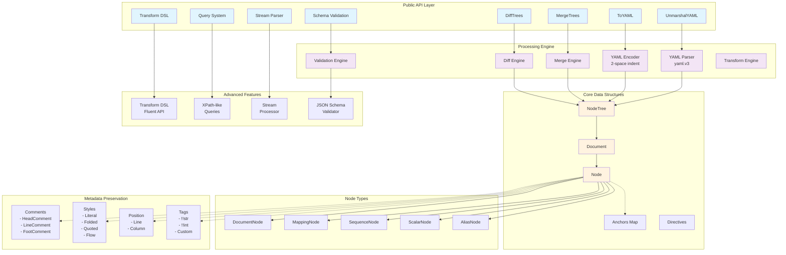
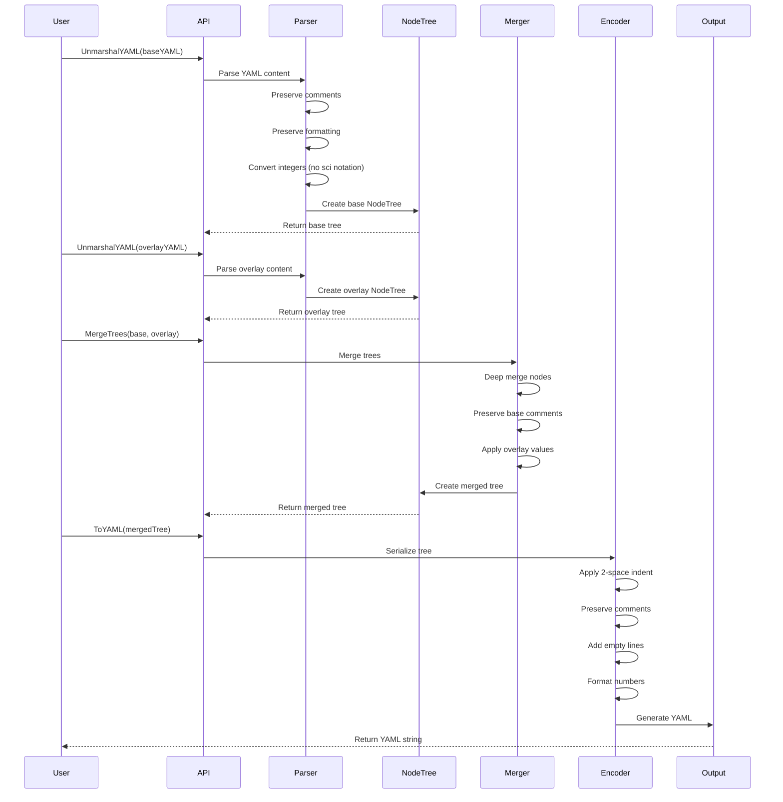
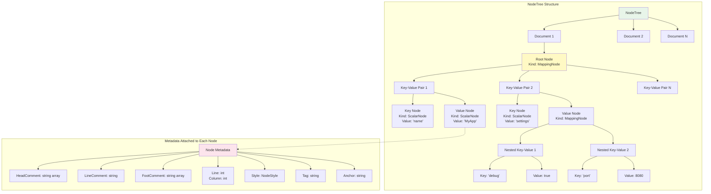
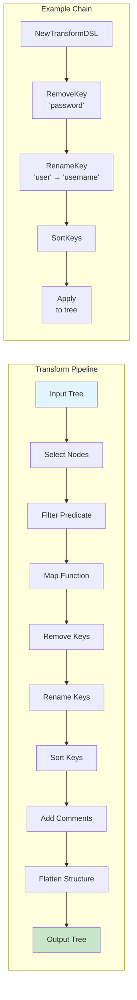
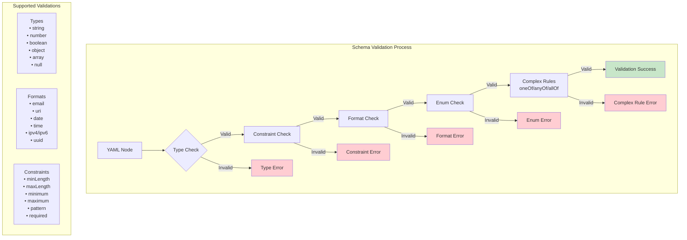
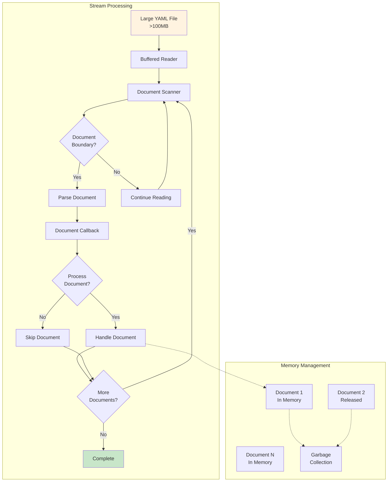
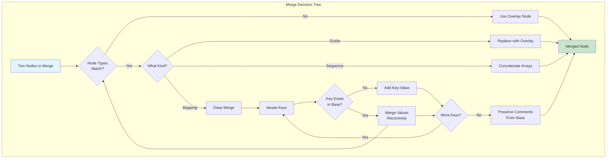
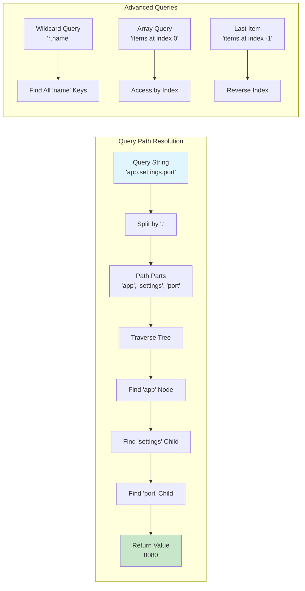

# Architecture Documentation

## System Architecture

## Application Flow - Parse and Merge

## Node Tree Structure

## Transform DSL Flow

## Validation Flow

## Stream Parser Architecture

## Merge Strategy

## Query System

